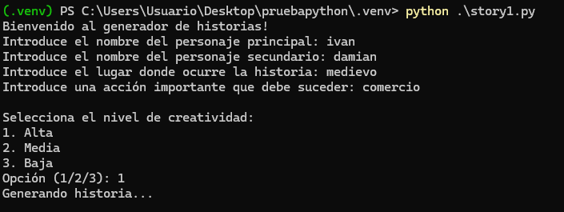

# Generador de Historias con Text Generation WebUI

Este proyecto es una aplicación en Python que permite generar historias interactivas utilizando la API de **Text Generation WebUI**. El programa solicita información del usuario, como personajes y escenarios, y genera relatos detallados y creativos. Además, traduce automáticamente las historias generadas al español.

#

## Características

- **Entrada personalizada**: Define los personajes principales, secundarios, ubicación y eventos clave.
- **Configuración ajustable**: Permite elegir el nivel de creatividad para controlar el estilo narrativo.
- **Traducción automática**: Traduce las historias generadas al español para mayor accesibilidad.
- **Compatibilidad con LLMs de Hugging Face**: Diseñado para modelos como [Qwen-2.5-7B](https://huggingface.co/Qwen/Qwen2.5-7B).

## Requisitos

- Python 3.8 o superior
- [Text Generation WebUI](https://github.com/oobabooga/text-generation-webui)
- Un modelo de generación de texto de Hugging Face (ejemplo: [Qwen-2.5-7B](https://huggingface.co/Qwen/Qwen2.5-7B))
- Bibliotecas Python:
  - `requests`
  - `json`

## Instalación

1. Clona este repositorio:
   ```bash
   git clone https://github.com/tu-usuario/generador-historias.git
   cd generador-historias
   ```
2. Instala las dependencias necesarias:
   ```bash
   pip install -r requirements.txt
   ```
3. Configura e inicia el servidor de Text Generation WebUI con el modelo de Hugging Face:
   - Descarga un modelo compatible (por ejemplo, [Qwen-2.5-7B](https://huggingface.co/Qwen/Qwen2.5-7B)).
   - Carga el modelo en **Text Generation WebUI** siguiendo la documentación oficial.
   - Asegúrate de que el servidor esté escuchando en `http://127.0.0.1:5000`.

## Uso

1. Ejecuta el script principal:
   ```bash
   python story1.py
   ```
2. Ingresa los datos requeridos:
   - Nombre del personaje principal.
   - Nombre del personaje secundario.
   - Lugar de la historia.
   - Acción clave que ocurrirá.
3. Selecciona el nivel de creatividad (alta, media, baja).
4. Observa cómo se genera la historia en inglés y su traducción al español.

## Ejemplo

### Arranque de *text-generation-webui* como API


### Entrada del Usuario


### Salida Generada

#### Historia en Inglés


#### Traducción al Español

